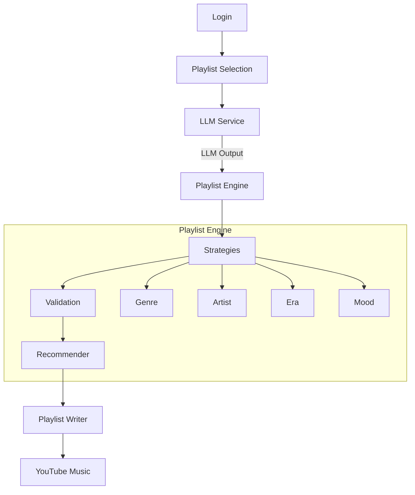

# CurateTube

Turn your messy YouTube Music playlists into organized collections of songs - smaller, focused playlists based on genre, artist, era, mood, language and more with AI.

## Clone the Repository

```bash
git clone https://github.com/aniket-969/CurateTube.git
cd curatetube
```

## Prerequisites

- Node.js
- API key from a supported AI provider:
  - DeepSeek (recommended)
  - Google Gemini
  - OpenAI
- At least one AI provider API key is required.

## Setup

### 1. Install dependencies

```bash
npm install
```

### 2. Configure your AI provider

Create a `.env` file in the project root:

```env
VITE_DEEPSEEK_API_KEY=
VITE_GEMINI_API_KEY=
VITE_OPENAI_API_KEY=
```

At least one API key is required. You only need to configure the provider you want to use.

### 3. Build the extension

```bash
npm run build
```

### 4. Load the extension

1. Open your browser's extension management page.
2. Enable **Developer mode**.
3. Select **Load unpacked**.
4. Select the generated `dist` directory after running npm run build.

## Project Structure

```text
src/
├── App.jsx                 # Application entry and routing
├── main.jsx                # React entry point
├── index.css               # Global styles
│
├── cache/                  # Local caching
│   └── ytPlaylist.js       # Functions and variables to store yt playlists
│
├── pages/                  # Application screens
│   ├── login.jsx
│   ├── playlist.jsx
│   ├── generatedPlaylist.jsx
│   └── creatingPlaylists.jsx
│
├── playlist/                  # Playlist analysis and recommendation pipeline
│   ├── playlistEngine.js      # Core playlist-generation engine. Takes classified videos and produces playlist candidates according to the configured strategies
│   ├── playlistRecommender.js # Determines which validated playlist candidates should be selected by default, prioritizing playlist size and diversity.
│   ├── playlistValidator.js   # Filters out playlist candidates produced by the engine.
│   └── thresholds.js          # Defines thresholds used when determining valid playlist groups
│
├── services/               # External services and API integrations
│   ├── auth.js             # Google/YouTube authentication
│   ├── youtube.js          # Provides functions for reading YouTube playlists and playlist items through the YouTube Data API.
│   ├── ytPlaylistWriter.js # Handles writing operations to YouTube, including creating playlists and adding videos.
│   │
│   └── llm/                # AI/LLM integration
│       ├── index.js        # Imports and exposes the supported LLM providers
│       ├── prompt.js       # System prompt used for song classification
│       └── providers/
│           ├── deepseek.js # DeepSeek API/SDK integration
│           ├── gemini.js   # Gemini API/SDK integration
│           └── openai.js   # OpenAI API/SDK integration
│
├── strategy/               # Playlist generation strategies
│   ├── artist.js           
│   ├── era.js
│   ├── genre.js
│   ├── mood.js
│   └── index.js
│
└── utils/                  
    ├── data.js             # test data
    └── helper.js           # helper functions used at other files
...
```

## How It Works



### How It Works

### 1. Login

CurateTube authenticates the user with their Google/YouTube account so it can access their YouTube playlists and create or update playlists on their behalf.

### 2. Playlist Selection

The user selects the YouTube playlist they want to organize. CurateTube fetches the playlist's videos in batches and prepares their metadata for analysis.

### 3. LLM Classification

The playlist data is sent to the AI provider selected by the user.

The LLM analyzes each song and classifies it using attributes such as:

- Artist
- Genre
- Subgenre
- Mood
- Language
- Era

These classifications are then passed to the Playlist Engine.

### 4. Playlist Engine

The Playlist Engine uses the classified songs to generate playlist candidates.

The engine applies the configured strategies, such as:

- Genre
- Artist
- Era
- Mood

The generated candidates are then passed through the following stages:

**Strategy → Validation → Recommendation**

- **Strategy** — Generates focused playlist candidates from the classified songs.
- **Validation** — Filters out playlist that might not be worth creating.
- **Recommendation** — Evaluates the validated playlists and selects a diverse set to be recommended by default.

All validated playlists remain available to the user. The recommendation stage only determines which playlists are selected by default.

### 5. Playlist Selection & Editing

The user is shown the generated playlists with their song counts.

Recommended playlists are selected by default, while the user can:

- Select or deselect playlists
- Rename playlists
- Choose additional playlists that were not automatically recommended

### 6. Playlist Writer

Once the user confirms their selection, CurateTube creates the playlists on YouTube and adds the recommended songs to each playlist.

If a target playlist already exists, CurateTube checks its existing videos and only adds songs that are not already present.

## License

CurateTube is licensed under the MIT License. See the [LICENSE](LICENSE) file for details.

